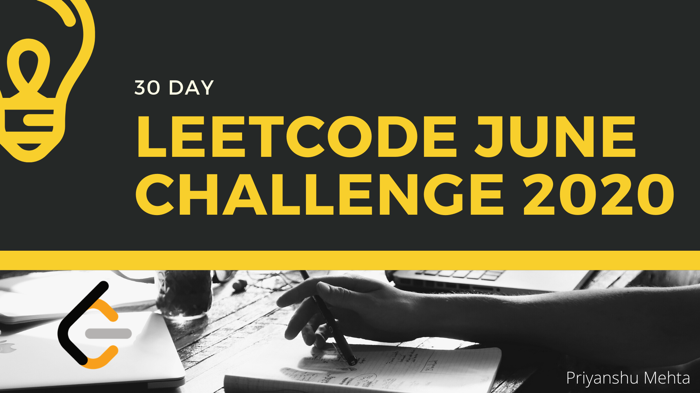

# Leetcode June Challenge
#### June Leetcode Challenge #leetcode #junechallenge #interviewquestions

### Day N --> Question --> Topic --> Difficulty --> Link to blog
Day 1 : Invert Binary Tree --> Trees --> Easy --> https://bit.ly/2TVJ1l5  
Day 2 : Delete Node in a Linked List --> Linked List --> Easy --> https://bit.ly/2XtZdMZ  
Day 3 : Two City Scheduling --> Greedy Algorithm --> Medium --> https://bit.ly/2XZmTaX  
Day 4 : Reverse String --> Two Pointer --> Easy --> https://bit.ly/3dBSHcs  
Day 5 : Random Pick with Weight --> Arrays & Binary Search --> Medium --> https://bit.ly/3eMmqj0  
Day 6 : Queue Reconstruction by Height --> Greedy & Arrays --> Medium --> https://bit.ly/30ejffT  
Day 7 : Coin Change 2 --> DP --> Medium --> https://bit.ly/2Y8p7VB  
Day 8 : Power of Two --> Bit Count --> Easy --> https://bit.ly/3cJuFLo  
Day 9 : Is Subsequence --> Two Pointer --> Medium --> https://bit.ly/2XNhaGh   
Day 10: Search Insert Position --> Binary Search --> Easy --> https://bit.ly/2Uv0Zeu  
Day 11: Sort Colors --> 3 Pointer (Arrays) --> Medium --> https://bit.ly/2XPwZfu  
Day 12: Insert Delete GetRandom O(1) --> Hashmap & ArrayList --> Medium --> https://bit.ly/2XSi5p0  
Day 13: Largest Divisible Subset --> DP --> Medium --> https://bit.ly/3hzomxI  
Day 14: Cheapest Flight Within K Stops --> Graph & Dijkstra --> Medium --> https://bit.ly/30D0SBL  
Day 15: Search in a Binary Search Tree --> BST Property & Recursion --> Easy --> https://bit.ly/2YAK7o3  
Day 16: Validate IP Address --> Strings & Divide'n'Conquer (Regex) --> Medium --> https://bit.ly/2UNVOXc  
Day 17: Surrounded Regions --> DFS --> Medium --> https://bit.ly/3dchWkH  
Day 18: H-Index II --> Binary Search --> Medium --> https://bit.ly/3egbUk7 
Day 19: Longest Duplicate Substring --> Strings + Binary Search --> Hard --> https://bit.ly/3fLJsqZ  
Day 20: Permutation Sequence --> Math --> Medium --> https://bit.ly/2YZUJx8 
Day 21: Dungeon Game --> Dynamic Programming --> Hard --> https://bit.ly/3fKOFiw  
Day 22: Single Number 2 --> Bit Manipulation --> Medium --> https://bit.ly/3hPGFib  
Day 23: Count Complete Tree Nodes --> Trees --> Medium --> https://bit.ly/2B0Zaj8  
Day 24: Unique Binary Search Tree --> Dynamic Programming (Catalan Numbers) --> Medium --> https://bit.ly/31dwNJc  
